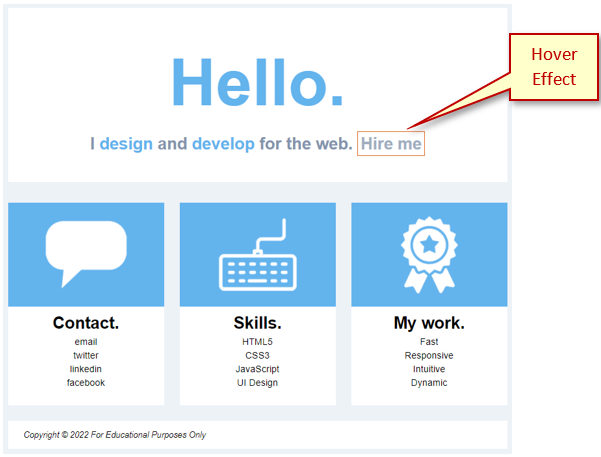

# Hello Build

## Review Instructions
You can follow along with your instructor to compare this build to the one you completed. The completed build should look like:

 

## Steps - HTML
Use the provided **center-page-framework** folder and add code as follows:
1. The `<head>` block:<br>

```html

```
2. The `<body>` block:<br>
    1. `<header>`:<br>

    ```html

    ```

    2. Add a `<section>` block:<br>

    ```html

    ```

    3. Add a `<div>` for the first column:<br>

    ```html

    ```

    4. Add a `<div>` for the second column:<br>

    ```html

    ```

    5. Add a `<div>` for the third column:<br>

    ```html

    ```

    6. Add a `<footer>` below the `</section>`:<br>

    ```html

    ```

## Steps - CSS
