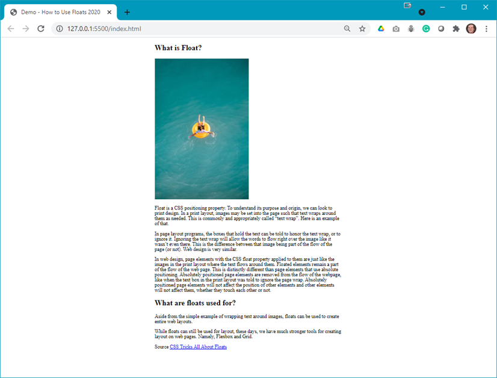
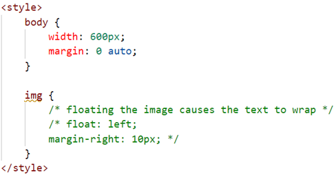
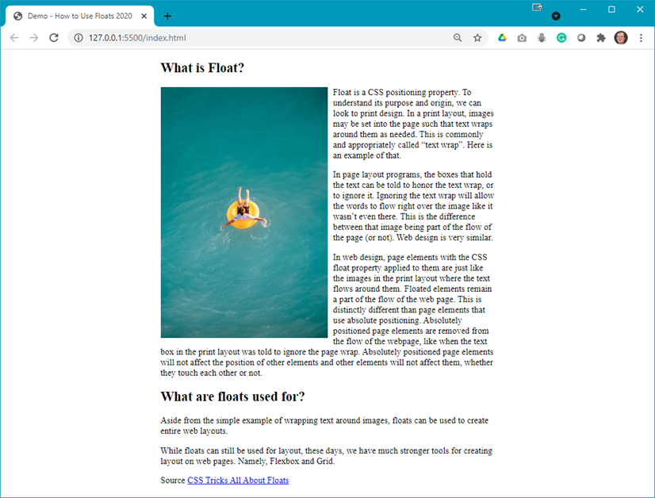

# Demo Floats

## Demo Instructions
You can follow along with your instructor to compare this build to the one you completed.

## Steps
1.	Download the **d**emo-floats.zip** file from Moodle and extract its contents to a folder named **demo-floats**.
2.	Open index.html in your browser to see something like: 

3. In your code editor you will see the following code: 

4. Uncomment the `float` and `margin` rules, save and refresh the browser to see: 

