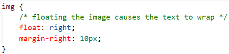
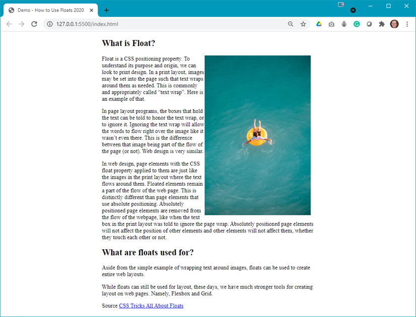
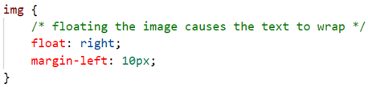
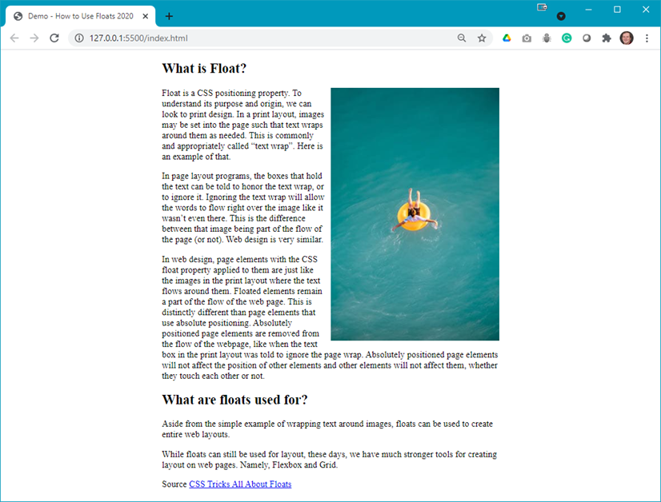

# Demo Floats

## Demo Instructions
You can follow along with your instructor to compare this build to the one you completed.

## Steps
1.	Download the **d**emo-floats.zip** file from Moodle and extract its contents to a folder named **demo-floats**.
2.	Open index.html in your browser to see something like: 

3. In your code editor you will see the following code: 

4. Uncomment the `float` and `margin` rules, save and refresh the browser to see: 
 
**Question**: What happened?
5. Now change the float rule to float the image on the right: 

6. Save and refresh your browser to see: 

7. As the text appears to be butting up against the image, and there is a bot of a right margin on the image, make the following change: 

8. Refresh your browser to see: 

## Summary
Floats are only one way to reposition, or _float_, a block-level object on a web page. You should have learned **flexbox** in COMP1017, thus in future lessons you will explore more of what flexbox can do.
