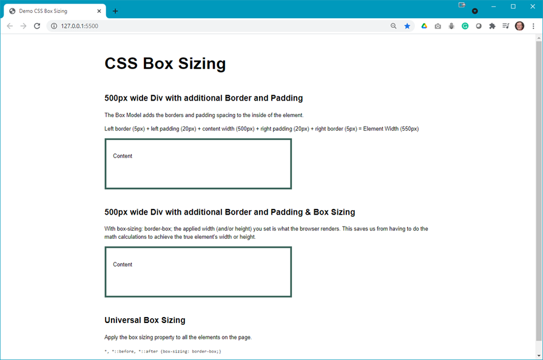
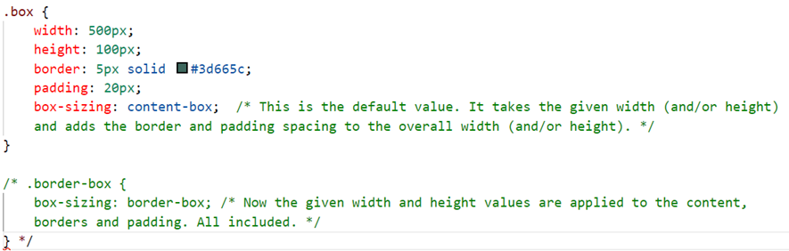
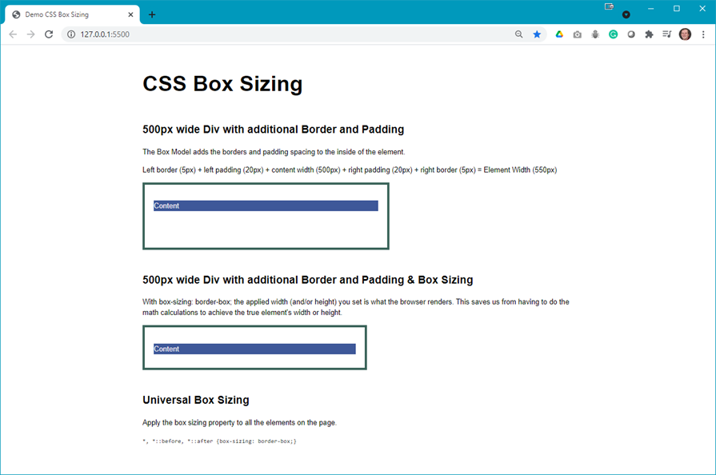
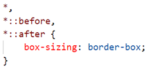
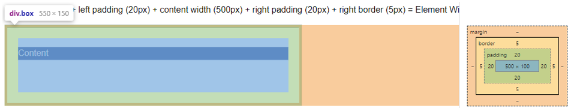
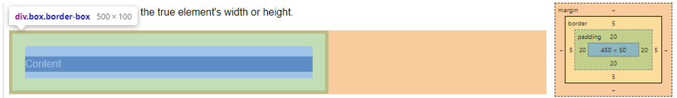

# Box Sizing

## Demo Instructions
You can follow along with your instructor to complete this build and/or you can use this document as a guide in completing the demo build.

## Steps
1. Download the **demo-box-sizing.zip** file from Moodle and extract its contents to a folder named **demo-box-sizing**.
2. Open index.html in your browser to see something like: 

3. In your code editor you will see the following code: 

4. Uncomment the `.border-box` class, save and refresh the browser to see: 
 
**Question**: What happened?
5. Add the following code to the top of your stylesheet: 

6. There may not be a big change but you should see: 

7. Now you need to use the developer tools to see the difference in the two boxes:
    1. `box-sizing: content-box;` 
    
    2. `box-sizing: border-box;` 
    
8. **Question**: If you want all your blocks on your web page to have the same width, which box-sizing would you use?