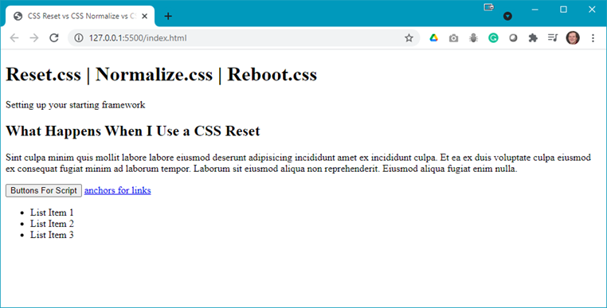
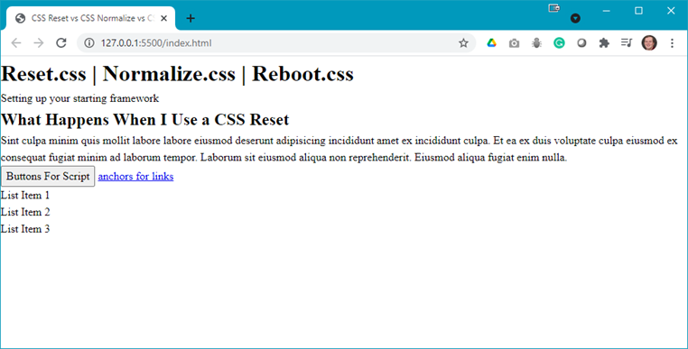
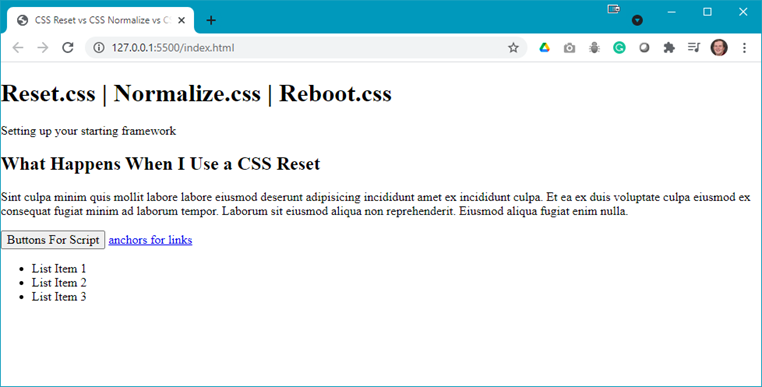
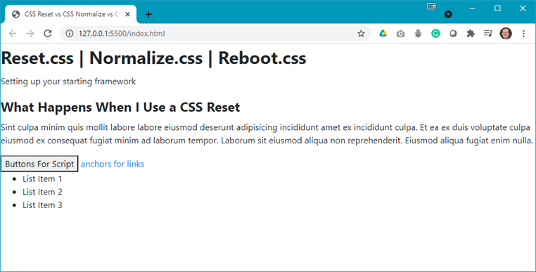

# Demo Resets

## Demo Instructions
You can follow along with your instructor to complete this build and/or you can use this document as a guide in completing the demo build.

## Steps
1. Download the **demo-reset.zip** file from Moodle and extract its contents to a folder named **demo-reset**.
2. Open index.html in your browser to see something like: 

3. In your code editor you will see the following code: 

4. Uncomment the first stylesheet link for **reset.css**, save and refresh the browser to see: 
 
**Question**: What happened?
5. Have a look at the **reset.css** code to verify your answer.
6. In your code editor, comment out the **reset.css** and uncomment the link for **normalize.css**. Refresh your browser to see: 
 
**Question**: What happened?
7. Have a look at the **normalize.css** code to verify your answer.
8. Back in the code editor, comment out the **normalize.css** link and uncomment the **reboot.css** link. Save and refresh your browser to see: 
 
**Question**: What happened?
9. Have a look at the **reboot.css** code to verify your answer.
10.	**Question**: which one of the three stylesheets do you use?
11.	You need to markup your document in the `<`head>` using a `<meta>` tag. Add the following code to your **index.html** file: 

Note: Google results will now truncate the description at ~300 characters. Previously it was recommended to keep the description length to 50 - 160 characters, but now that can increase to around 300.

You need to customize the content to match the summary of the web page.

