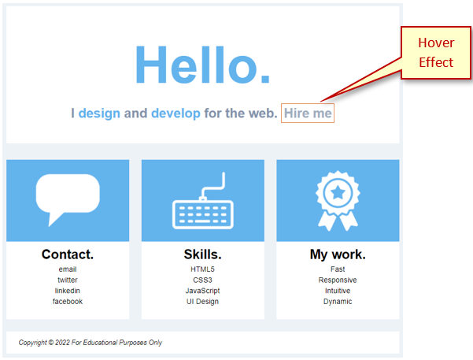

# Hello Build

## Review Instructions
You can follow along with your instructor to compare this build to the one you completed. The completed build should look like:

 

## Steps - HTML
Use the provided **center-page-framework** folder and add code as follows:
1. The `<head>` block:<br>

```html

```
2. The `<body>` block:<br>
    1. `<header>`:<br>

    ```html

    ```

    2. Add a `<section>` block:<br>

    ```html

    ```

    3. Add a `<div>` for the first column:<br>

    ```html

    ```

    4. Add a `<div>` for the second column:<br>

    ```html

    ```

    5. Add a `<div>` for the third column:<br>

    ```html

    ```

    6. Add a `<footer>` below the `</section>`:<br>

    ```html

    ```

## Steps - CSS
Add style rules as follows:
1. Body:
    1. Background color
    2. Font color 
    3. Font family<br>

    ```css

    ```

2. Header/Banner section:
    1. Heading:
        1. Font size
        2. Font styling<br>

        ```css

        ```

    2. Paragraph:
        1. Font colors
        2. Font styling<br>

        ```css

        ```
    3. Hyperlink:
        1. Styling
        2. Hover effect<br>

        ```css

        ```
3. Main:
    1. Section with 3 `<div>` elements, each representing a column:
        1. Flex container
        2. Spacing around
        3. Spacing between columns<br>

        ```css

        ```

    2. Each `<div>` needs styling for:
        1. Background color
        2. Center-align text
        3. Font sizing<br>

        ```css

        ```

4. Footer:
    1. Font styling
    2. Spacing around and inside
    3. Background color<br>

    ```css

    ```

## Validation
1. Validate your html using [https://validator.w3.org](https://validator.w3.org).
2. Check your document outline using [https://gsnedders.html5.org/outliner/](https://gsnedders.html5.org/outliner/).